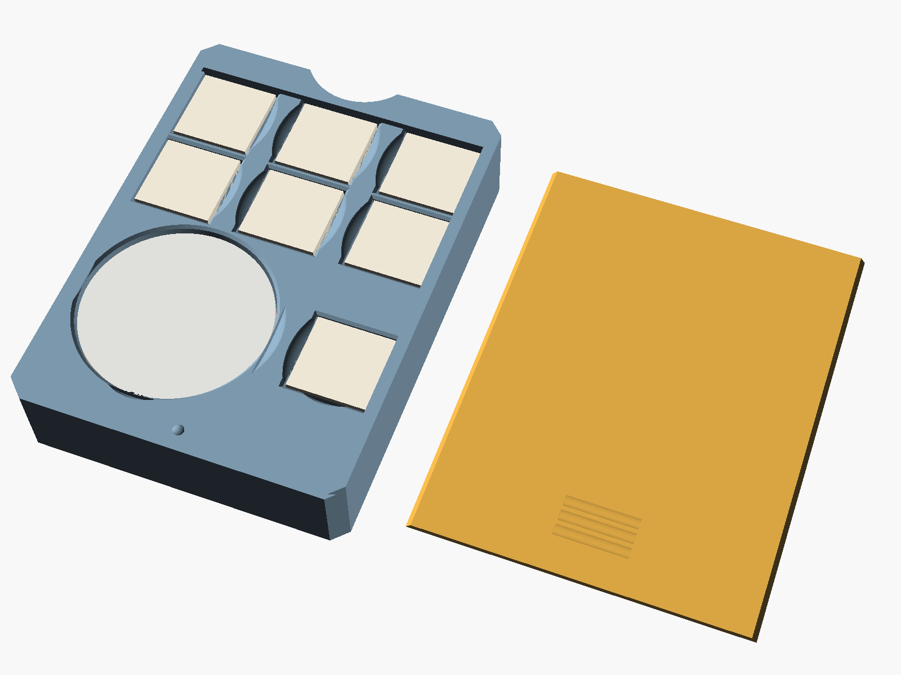

# deckblock

a dice and counter tray that lives INSIDE a top-opening deck box, alongside the cards.
one parametric source, two variants.

it was made to fit an ultimate guard boulder 100+. thats the box i own, and every
dimension in it came off that box or off the sleeves that go in it. its also universal,
which is arithmetic rather than a claim: width and height come off the card footprint,
and thats the same in every standard-size deck box. only depth varies between them.

the variants answer "do you carry a coin?", not "which game do you play". the layouts
were named after games for three releases and it was always slightly a lie - nothing in
either is game-specific. people picked the wrong one because they picked by the name on
the box rather than by what they actually carry.

fit spec: the slab is 67 x 91 x 18.6 mm. it drops into any top-opening deck box with an
interior at least 67 mm wide, 91 mm tall, with 19 mm of depth to spare.

the height is taken from the SLEEVE rather than the box. an ultimate guard katana
standard sleeve is 66 x 91 mm, and every deck in the box is that tall. so the test is
whether your sleeved cards stand up in it - if they do, so does this. taking the height
from the sleeve also puts the slab's top edge level with the top of the cards rather than
below them. it doesnt sink away from the opening.

the width is that sleeve plus 1 mm (`over_w`). the slab only has to fit the box, not sit
beside a card, and every millimeter there lands in the cavity field. that makes
width the one dimension still bounded by the REPORTED box interior rather than a
published figure. 0.75 mm of clearance per side, so a box 1 mm narrower than reported
still fits and one 1.5 mm narrower doesnt. set `over_w = 0` to sit exactly on the sleeve.

width and height are set by the card footprint and so are effectivley constant across
standard-size boxes. only depth varies. dimensioned around an ultimate guard boulder 100+
(interior about 68.5 x 67.5 x 93 mm), which is where the fit gaps come from. that box is
the only one whose interior figure has been looked up, and even that one is a reported
number rather than an official spec. treat the three numbers above as the thing to
measure against, not the brand.

| variant | holds | slab depth | card depth left |
|---|---|---|---|
| `nocoin` | 6 x 16 mm d6 + a 43.8 mm open bay for tokens | 18.6 mm | 48.9 mm |
| `coin` | 7 x 16 mm d6 + a ⌀38 mm flip-coin well, no bay | 18.6 mm | 48.9 mm |



## how it works

a slab that spans the full interior width and height of the case but only about 19 mm
of its roughly 67 mm depth. because its captured on all four sides by the case walls, it
cant shift, tip or rattle. a sliding lid encloses the contents.

the lid exits the BOTTOM edge. once the slab is seated in the case, the floor of the deck
box sits across that edge and blocks the lid. it can only come off once you lift the
slab out, using the finger scoop in the top rail.

```
                 slab           +-- 48.9 mm left for cards --+
   box wall  | <-18.6 mm-> |    |                              |  box wall
             |[d6][d6][d6] |    |   sideboard                  |
             |[d6][d6][d6] |    |                              |
             | open bay    |    |                              |
```

## the depth budget is the whole design

18.6 mm is the practical floor for an enclosed 16 mm die - the die itself is 86% of it:

```
  0.8  floor (with a push-out hole under each cavity)
 16.3  cavity depth      <- 16.0 of this is the die
  1.5  lid + its groove, running out to the top face
 -----
 18.6  mm
```

every millimeter added here is a millimeter taken from the card stack. thats why the
round wells are 16.3 mm deep and no deeper: a deeper well buys counter capacity you
wont use, and a double-sleeved 60-card deck needs roughly 45 mm. both variants therefore
land on the same 18.6 mm.

pick by whats in your bag, not by which game you play - nothing in either layout is
game-specific. mtg and riftbound players almost always want the no-coin one. pokemon
players almost always want the coin one.

the coin variant has MORE dice, not fewer. a round well's diameter sets the height of the
whole band it sits in. so the coin's band is 38.8 mm tall and leaves 22.2 mm of the 61 mm
interior beside it - exactly enough for a seventh die rather than dead space. the coin
costs the bay, not the dice.

there used to be a fourth line here: 1.4 mm of "retaining lip above the groove". it was
doing nothing. the groove is a DOVETAIL. the lid is trapezoidal and wide at its base, so
what stops it lifting out is the taper of the groove beside it, not material on top of
it. running the groove out to the top face costs nothing srtucturally, takes 1.4 mm
straight off the slab, and brings the lid flush with the frame.

a polyhedral die is cheaper than it looks. one resting on a face is only 0.795 x its
vertex-to-vertex width tall. so a 20 mm d20 in a custom layout stands 15.9 mm and clears
the standard 16.3 mm well without deepening anything. if you build a custom profile
around a d20, use `well(d20_size, d20_depth)` - `d20_depth` applies that rule for you
instead of the naive full width.

## the pokemon coin well

this was wrong for a long time. worth recording. the well was built around
`coin_d = 26.0`, assumed, not looked up. official pokemon coins run 29.8-51.6 mm. the
common modern flip coin is the 34 mm "large", the bigger authorized collectible is 38 mm,
and 25 mm compact ones and 51 mm jumbos sit at the extremes. a 26.8 mm well took only the
smallest of them, so for most people the coin wouldnt go in.

its now built for `coin_d = 38.0` - a ⌀38.8 mm well, which swallows every size below it:

| coin | ⌀ | fits |
|---|---|---|
| pokemon compact flip coin | ~25 mm | yes |
| us quarter | 24.26 mm | yes |
| pokemon LARGE flip coin (the common one) | 34 mm | yes |
| pokemon large collectible | 38 mm | yes |
| us half dollar | 30.61 mm | yes |
| pokemon jumbo | 51 mm | no - see below |

### what the coin costs

a round well's DIAMETER sets the height of the whole band it sits in. so a 38.8 mm well
is expensive twice over: its 38.8 mm tall, and it leaves only 22.2 mm of the 61 mm
interior beside it. two consequences:

- the coin gets one companion, not two. coin + two ⌀13.8 counter wells comes to 66.4 mm
  in a 61 mm interior - impossible at any wall thickness. its paired with the LARGE
  counter well rather than a small one, because that uses the leftover width better: a
  4.4 mm gap instead of 8.4 mm of dead space.
- the small counter well moved up to join the dice, whose band is only 16.8 mm tall and
  had width going spare. both counter sizes survive. nothing was dropped.

measured, at `div_wall = 1.6`:

| layout | bay | tightest gap | |
|---|---|---|---|
| `[small, d6, d6]` / `[coin, large]` | 15.8 mm | 4.4 mm | shipped |
| `[large, d6, d6]` / `[coin, small]` | 14.8 mm | 4.8 mm | 8.4 mm of dead width |
| `[small, lg, d6]` / `[coin, d6]` | 14.8 mm | 5.4 mm | loses a die |
| `[large, d6, d6]` / `[coin, small, small]` | 17.9 mm | -2.7 mm | impossible |

the bay pays for it: 25.9 mm before, 15.8 mm now. a 25.4 mm status marker no longer lies
flat in it. thats the delliberate trade - a coin well that fits the coin most people own
beats a bay sized for a marker you could keep in the open.

### jumbo coins cant be housed

a 51 mm jumbo needs a 51.8 mm well. that exceeds the tallest band the slab can hold once
the dice row and the bay's bottom wall are accounted for. it doesnt fit loose in the bay
either - the largest bay any layout can offer is 41.9 mm. nothing in a 67 x 91 slab takes
one. if you own a jumbo, it lives outside the insert.

### internal dividers run thinner than the perimeter

`div_wall = 1.6` separates the two bands, against `wall = 2.5` for the outer shell. the
perimeter cant thin, the lid groove already cuts 1.2 mm into it and leaves 1.3 mm. a
divider between two cavities carries no load, so it buys 0.9 mm of bay.

one divider is excluded: the last band's gap to the bay carries the detent bump, whose
footprint is 2.30 mm across. on a 1.6 mm divider the dome would overhang its own wall
and need support, so that gap stays at `wall`.

### what this insert deliberately doesnt do

some games want a second card group at the table - riftbound's rune deck and battlefields
are the clearest case. the obvious idea is a card slot in the slab for them. it cant be
done in this case. the slab is 91 mm tall, exactly a sleeve, and a sleeved standard card
is the same 91 mm. the cards are 3 mm too tall for any slot the slab could contain, in
any orientation. sixteen sleeved cards also want about 11 mm of the depth budget, which
is well over half the 18.6 mm the whole insert gets. keep the runes and battlefields
banded in the main card compartmnet.

## measure before you print

theres no test print at this size to fall back on, so the numbers have to be right up
front. two of them arent measurements:

- the case interior (68.5 x 67.5 x 93 mm) is a widely-reported figure, not an official
  one. check yours before committing to a 3-hour body.
- the counter diameters are plausible values for common accessories, not calipered
  readings of yours.

everything that governs fit is a single named parameter at the top of `deckblock.scad`,
so a miss is a one-number change and a re-render:

| symptom | change |
|---|---|
| dice too tight / too loose | `die_clearance` (0.8 total, ±0.2) |
| counters too tight / too loose | `well_clearance` (0.8 total, ±0.2) |
| counters are the wrong size | `ctr_small_d` / `ctr_large_d` / `coin_d` / `d20_size` |
| lid binds / too loose | `lid_side_clearance` (0.5 total, ±0.2) |
| lid rattles vertically | `lid_vert_clearance` (0.3) |
| detent too weak / too strong | `detent_h` (0.60), see below. set to 0 to remove it |

one clearance parameter governs every cell of a kind: `die_clearance` for square pockets,
`well_clearance` for round wells. so if your SMALLEST counters bind, thats
`well_clearance`, not the layout.

the lid is the cheap part to print: about 20 minutes and 5.8 cm³. it wont tell you
whether the slab fits your case. it does tell you whether the groove clearances and the
detent are right, since its the same extrusion on every profile.

## rendering

```sh
./render.sh              # both variants -> stl/<variant>/ + preview_<variant>.png
./render.sh coin         # just one
```

or open `deckblock.scad` in the openscad gui and pick `variant` in the customizer panel.
installed here via `brew install --cask openscad@snapshot` (the stable `openscad` cask
is disabled on macos - it fails the gatekeeper check).

## print settings

print FLAT, open side up, exactly as the stl is oriented. verified on every body: zero
downward-facing facets steeper than 45°, and the only overhang on a lid is its 2.87 mm²
detent dimple. no supports anywhere.

| | body | lid |
|---|---|---|
| layer height | 0.20 mm | 0.16 mm |
| walls | 3 | 4 |
| infill | 15% gyroid | 100% |
| supports | none | none |

solid volumes:

| variant | body | lid |
|---|---|---|
| `nocoin` | 31.6 cm³ | 6.3 cm³ |
| `coin` | 50.7 cm³ | 6.3 cm³ |

down 12% across the bodies from a space-saving pass. the top rail cut from 10 mm to 7,
the floor from 1.0 to 0.8, and every divider BETWEEN two bands thinned from `wall` to
`div_wall`. each of those also hands the space back to the bay.

with the settings above expect roughly 24-30 g / 2.5-3 h for the nocoin body and about
7 g / 20 min for a lid. scale the coin body by volume and confirm in orca.

the only feature on any part that overhangs is the lid's single 0.35 mm detent dimple
(2.87 mm², measured, on every profile). it bridges over about 2.9 mm in about three
layers and needs no support. every BODY measures exactly 0.00 mm² of unsupported facet.
the pinch notches keep it that way by coonstruction: theyre cut downward from the cavity
mouth, so nothing is ever left spanning over one.

tightest wall: 3.3 mm, between the coin well and its neighbor in the `coin` variant's
third band. thats eight perimeters at 0.4 mm and it thickens immediately either side of
the tangent line. nothing in any shipped profile is thinner.

## one lid fits both

both lids are the SAME file - identical md5, not merely similar, and its checked rather
than assumed: `tools/build_all.sh` compares the md5s on every build.

they used to differ by the position of one dimple. the detent bump sat on the divider
between the last band and the bay, and that divider lands somewhere different in every
layout. any lid would slide in any body, but only its own would click.

the detent is now anchored to the BOTTOM wall, the one piece of solid material every
layout has in the same place, at `detent_y = 4.0`. the lid no longer references the band
list at all, so `insert_lid()` doesnt take one.

the bottom wall is only `wall` thick. that isnt enough to seat the bump and still keep
the lid's mating dimple clear of the lid's open end. so a small boss tihckens it locally:
11 mm wide, reaching 3 mm into the bay. that costs about 0.5 cm³ and a sliver of the
bay's bottom edge - a fair price for one lid instead of three. the lid's grip grooves
moved from y = 4 to y = 8 to stay clear of the dimple, which sits at y = 3.5.

## getting things back out

a pocket sized to hold a die also holds onto it. two features fix that, and both are
sized by rule rather than by eye.

### push-out holes

a hole through the floor behind every cavity, so you push a die or a counter stack out
from behind with a fingertip instead of picking at it.

the hole is sized from the cavity, not to a fixed number. it used to be capped at 14 mm,
so the hole behind a ⌀38.8 mm coin well was the same size as the one behind a ⌀17.8 mm
counter well. the coin sat on a 12.4 mm ledge with a fingertip-sized hole in the middle
of it. you could press the coin, but not tip it. now:

```
hole = min( cavity × pushout_frac ,  cavity − 2 × pushout_ledge )
```

`pushout_frac = 0.80` scales the hole with the cavity. `pushout_ledge = 1.6` is a floor
that takes over on small cavities, where the fraction alone would leave too little
material.

| cavity | old | new | ledge under contents | limited by |
|---|---|---|---|---|
| ⌀13.8 small counter well | 10.6 | 10.6 | 1.20 mm | ledge |
| 16.8 mm d6 pocket | 13.6 | 13.44 | 1.28 mm | proportion |
| ⌀17.8 large counter well | 14.0 | 14.24 | 1.38 mm | proportion |
| ⌀20.8 vp die well | 14.0 | 16.64 | 1.68 mm | proportion |
| ⌀38.8 coin well | 14.0 | 31.04 | 3.48 mm | proportion |

`pushout_d` survives as an optional absolute cap, deefaulting to 0 (none).

nothing can fall through, because the contents are captured sideways by the cavity
walls. a 16 mm die over a 13.44 mm hole still rests on all four corners of its face and
can only move ±0.4 mm. a 38 mm coin over a 31.04 mm hole keeps 3.5 mm of ledge all the
way round.

### pinch cutouts

a dish taken out of the divider beside each cavity. it works WITH the push-out hole
rather than instead of it. push the die up from behind, and the dish is what lets you
get a finger onto its side and catch it.

the shape is a segment of a large circle, not a round-bottomed slot. `notch_arc = 60`
sets how much of that circle is used, a sixth. the radius follows from the bite, so the
sweep stays long and smooth instead of becoming a tight bowl. `notch_depth = 4.5` is how
far it reaches down the side of the die.

each edge is sized against the divider its actually cutting. a divider between two
cavities is bitten from both sides, so each side takes half the spare material. a divider
facing the open bay is bitten once and takes all of it. every divider necks to exactly
`notch_min_wall = 1.2` mm at the notch, whatever it started at. thats the most the cut
can take without going thinner than one number you control.

in practice the side edges, cut into 3.3-6.8 mm dividers, get bites of 1.05-2.2 mm. the
cross-band edges sit on the 1.6 mm `div_wall` divider and would get 0.2 mm, which is a
scratch rather than a grip. so dishes below 0.3 mm arent generated at all. thats the
deliberate trade for thin dividers: the space goes to the bay, and the grip lives on the
side edges.

two properties worth knowing:

- they cant introduce an overhang. the dish is an ellipsoid whose center sits
  `notch_ease` ABOVE the cavity mouth. every scrap of material is below the mouth, hence
  below the center, so every cut surface faces upward. thats also what eases the rim
  instead of leaving a 90° lip. every body measures 0.00 mm² unsupported.
- they cant breach a wall. the full set is clipped to the divider field, inside the
  outer walls and below the top rail. a notch that would break out erases itself
  instead of being a bug. each dish is aditionally clipped to its own side of the edge,
  so it cant reach across a cavity and nibble the divider opposite.

the subtree is wrapped in `render()`. without it the preview's csg normalizer explodes on
the clipped dishes and gives up. it makes no difference to the exported geometry.

set `pinch_notch = false` to omit them entirely.

## layouts

each profile is a stack of bands, laid out top-down under the finger rail. whatever
height is left at the bottom becomes the open bay. within a band, gaps are derived to
fill the interior width.

```
band = [ [cell, cell, ...], gap_after, cell_gap ]
cell = ["sq", w, h, depth]     rect pocket (dice, card-shaped markers)
     | ["rd", d, d, depth]     round well  (counters, coins, a d20)
```

so a new layout is a few lines. set `variant = "custom"` and edit `custom_bands`:

```scad
custom_bands = [
    [[ d6(), d6(), d6() ],                                 div_wall, 0],
    [[ well(ctr_small_d, well_depth), well(coin_d, 16.3) ], wall,    0],
];
```

`cell_gap = 0` spreads the cells to fill the width. a positive value uses that fixed gap
and centers the block instead.

| variant | band 1 | band 2 | band 3 | bay |
|---|---|---|---|---|
| `nocoin` | 3 x d6 | 3 x d6 | none | 43.8 mm |
| `coin` | 3 x d6 | 3 x d6 | ⌀38.8 coin well + d6 | none |

the bay is one undivided space. it used to carry a center rib to support the lid
mid-span. that bought very little, since the lid is captured in the side grooves along
its whole length. and it cost a lot: it turned one pocket you can actually reach into two
narrow ones. set `bay_rib = true` to bring it back.

## publishing

`./prep_release.sh` rebuilds `dist/` from scratch - stls, 3mfs, images, source and docs,
with the models named so they sort into the order you should print them:

```
dist/
  models-stl/  Deckblock_<Variant>_{1-body,2-lid}.stl
  models-3mf/  the same parts as 3MF (MakerWorld prefers these)
  images/      1-<Variant>.png, 2-fits-in-case.png, 3-push-out-holes.png
  source/      deckblock.scad + the render scripts
  README.txt   LICENSE.txt
```

every exported stl is run through `tools/meshcheck.py --strip`, which asserts the mesh is
a closed 2-manifold: every edge shared by exactly two triangles, no zero-area facets. if
any turn up it rewrites the file without them. three checks worth knowing:

- the nocoin body comes out genus 6 and the coin body genus 8, one per cavity. thats an
  independent coonfirmation that every cavity got its push-out tunnel. if a hole ever
  failed to cut, the genus would drop.
- the bodies carry zero-area facets, 18 on `nocoin` and 16 on `coin`, and the published
  stls have them stripped. they come
  from the flush groove: with `cap_t = 0` the groove's top edge lands exactly on the
  slab's top face. the mesher leaves a few degenerate facets along that coincidence. they
  sit on an already-closed mesh - 0 open edges, 0 non-manifold edges with them discarded
  - so removing them is provably safe. running the cut past the top face along the same
  taper was tried and made it worse (8 -> 12), so the strip stays.
- 3mf round-trips exactly. re-importing `Deckblock_Dice_1-body.3mf` gives 10056 triangles
  and 31.593 cm³, the same as the stl. the 3mfs are NOT stripped, though: meshcheck reads
  stl only, so `prep_release.sh` strips the stls and the 3mfs ship with their degenerate
  facets. slicers dont care, but if youre diffing the two formats, thats the
  difference.

`LISTING.md` holds the listing copy. the license is CC BY-NC-SA 4.0, set in
`LICENSE.txt` - change that file and the listing's license field together if you want
something else.

## what has been printed

not this exact size. the prints in `photos/` are an earlier build at 66 x 88, before the
slab took its height from the sleeve. everything else about them is what ships: the flush
lid, the arc notches, the push-out holes, the bottom-wall detent, the 18.6 mm depth
budget. so the geometry is proven and the outside size isnt, and theres no cheap coupon
to catch a bad fit. print one body and lid and check them in a real box before you trust
the fit.

an earlier prototype than that was printed too, and its the reason the detent got
rebuilt. it was reported as doing nothing, which turned out to be exactly right and
provable from the numbers.

## dimensions used

| | value | source |
|---|---|---|
| case exterior | 76 x 75 x 98.5 mm | ultimate guard product data |
| case interior | 68.5 x 67.5 x 93 mm | ultimate guard boulder 100+. reported, not official - measure yours |
| slab | 67 x 91 x 18.6 mm | 0.75 mm/side across the width, 1.0 mm/side up the height |
| die pocket | 16.8 mm sq x 16.3 deep | 0.4 mm/side around a 16.0 mm die |
| lid in groove | 0.25 mm/side, 0.3 mm vertical | derived from the groove geometry. printed once, not measured back |

the counter diameters are assumptions, not measurements. `ctr_small_d = 13.0`,
`ctr_large_d = 17.0` are plausible figures for common accesories, but nobody has put
calipers on yours. `coin_d = 38.0` isnt a guess. its the larger authorized pokemon coin
size, and the well takes every smaller one. measure them and edit the four numbers
before you print a body.

width and height are set by the card footprint and should be the SAME across the boulder
sizes (60+/80+/100+/133+). only the depth budget changes, and only `box_int_d` in the
report line depends on it. that reasoning is untested on anything but the 100+.

## files

| file | what |
|---|---|
| `deckblock.scad` | parametric source - edit this, everything else is generated |
| `render.sh` | renders every profile |
| `preview.scad` | preview render only, not printable |
| `stl/<variant>/` | `<variant>_body.stl`, `<variant>_lid.stl` - working output |
| `prep_release.sh` | builds `dist/`, the upload bundle |
| `tools/meshcheck.py` | watertight / manifold validator, with `--strip` to drop zero-area facets |
| `context.scad` | exploded in-case render for the listing, not printable |
| `LISTING.md` | paste-ready listing copy - the single source of truth for the description |
| `photos/` | prints of an earlier build, with an index saying which shots still represent what ships |
| `LICENSE.txt`, `dist_README.txt` | shipped inside `dist/` |
| `dist/` | the upload bundle. regenerated from scratch by `prep_release.sh` |
| ~~`boulder_deckblock.scad`, `stl/insert_*.stl`~~ | deleted from the repo. the original mtg-only source and its stls - they were the reference the regression check differenced against. see the note under that check. |

### other checks

- overhangs. every body measures 0.00 mm² of unsupported facet. a lid measures 2.87 mm²,
  which is its detent dimple and matches π x 0.963² = 2.91.
- wall breach. a probe solid covering both side walls and the bottom wall, below the
  groove and clear of the corner reliefs and finger scoop, was differenced against each
  body. nothing remained on any profile - no notch reaches an outer wall.
